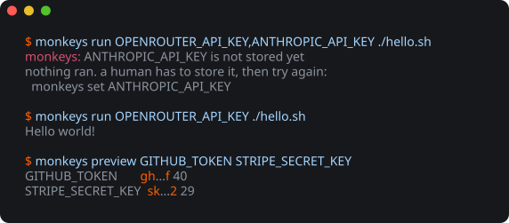

<p align="center">
  
</p>

<h1 align="center">monkeys</h1>

<p align="center">
  Environment variables kept in your operating system's keyring,<br>
  handed to one command at a time.<br>
  The name reads as <em>mon keys</em>: my keys.
</p>

<p align="center">
  
  
  
</p>

<p align="center">
  
</p>

A secret written into a shell startup file is readable by anything that can read
your home directory, and it follows you into dotfile backups and git history.
`monkeys` keeps it in the keyring and puts it into the environment of the one
command you are running, by name.

On macOS the keyring is the login keychain, reached through Security.framework.
On Linux it is whatever answers the Secret Service D-Bus API, which is
gnome-keyring on most desktops and KWallet on KDE, reached through
`secret-tool`.

## Install

Needs a Swift toolchain, and macOS 13 or later, or a Linux distribution Swift
supports. On Linux, install `secret-tool` as well: `libsecret-tools` on Debian
and Ubuntu, `libsecret` on Fedora and Arch.

```sh
git clone https://github.com/eastriverlee/monkeys
cd monkeys
make install
```

The binary lands in `~/.local/bin`. Point `INSTALL_DIRECTORY` somewhere else if
you keep your tools elsewhere:

```sh
make install INSTALL_DIRECTORY=/usr/local/bin
```

### For a coding agent

The binary is the whole tool, and an agent that can run a shell can already use
it. Installing the skill is what makes it reach for `monkeys` on its own,
rather than asking you to paste a key.

In Claude Code:

```sh
claude plugin marketplace add eastriverlee/monkeys
claude plugin install monkeys@monkeys
```

Elsewhere, copy `skills/monkeys/SKILL.md` into whatever directory your agent
reads skills from.

The skill restates a few invocations so an agent knows them before it runs
anything. `make check` holds that copy to the binary, failing when the skill
names a command `monkeys help` does not list.

## Use

Store a value. The prompt hides what you type:

```
$ monkeys set OPENROUTER_API_KEY
Value:
stored OPENROUTER_API_KEY
give it to a command with:
  monkeys run OPENROUTER_API_KEY <command>
```

Then spend it on the one command that needs it:

```sh
monkeys run OPENROUTER_API_KEY ./bench
monkeys run OPENROUTER_API_KEY,GITHUB_TOKEN ./deploy
```

`run` puts the values you name into that command's environment and nowhere
else, then replaces itself with the command, so the exit status, the output and
the signals are the command's own. With every name stored it is invisible: the
line behaves as though you had typed `./bench`.

A name you have not stored stops the run before it starts:

```
$ monkeys run OPENROUTER_API_KEY,ANTHROPIC_API_KEY ./bench
monkeys: ANTHROPIC_API_KEY is not stored yet
nothing ran. ask the person to store it, then try again:
  monkeys set ANTHROPIC_API_KEY
```

That message is written to be passed on. An agent that meets it knows which
values are missing, that nothing happened, and what to ask its person for.

## Every shell, if you want it

`run` hands a value to one process. The older habit is to put every value into
every shell, which `export` and `shell-init` still do:

```sh
monkeys shell-init      # appends the line below to your startup file
eval "$(monkeys export)"
```

It costs what it sounds like it costs. Every program you start from that shell
inherits every secret you own, including the ones it has no business seeing.
`run` exists because most commands need one value and none of the rest.

`shell-init` writes `~/.zshrc` for zsh and `~/.bashrc` for bash
(`~/.bash_profile` on macOS), says so when the line is already there, and puts
it at the end of the file, below whatever adds the install directory to `PATH`.
Set `MONKEYS_SHELL_PROFILE` to send it somewhere else, such as a file your
startup file sources.

## Commands

| command | what it does |
| --- | --- |
| `monkeys set <NAME>` | read a value and store it |
| `monkeys list` | print every stored name |
| `monkeys preview [NAME...]` | print each value masked, with its length |
| `monkeys remove <NAME>` | delete one value |
| `monkeys run <NAME>[,<NAME>] <command>` | run a command with those values in its environment |
| `monkeys run --all <command>` | the same, with every stored value |
| `monkeys export [NAME...]` | print shell export lines, for a shell to eval |
| `monkeys shell-init` | add that eval to your shell startup file |

`monkeys` takes no value as an argument, so storing one never types it: your
shell history and the process table both see `monkeys set GITHUB_TOKEN` and
nothing more. When standard input is not a terminal, `set` reads the value from
there:

```sh
pbpaste | monkeys set GITHUB_TOKEN        # macOS
wl-paste | monkeys set GITHUB_TOKEN       # Linux, Wayland
```

Naming no name means every name, for `preview` and `export`. `run` asks to be
told, since the names are how it knows what to check for and what to leave out;
`--all` is there for when you would rather not say.

Output is coloured only when it is going to a terminal, and never for `export`
or `list`, whose output a shell or a script reads. `NO_COLOR` turns colour off,
`CLICOLOR_FORCE` turns it on for a pipe, and an empty value for either counts
as unset.

## Looking without reading

Nothing here prints a stored value. The closest is `preview`, which answers the
question you usually have, which is whether the right value is in there:

```
$ monkeys preview
GITHUB_TOKEN        gh...f 40
OPENROUTER_API_KEY  sk...2 73
```

It shows the first two characters, the last one, and the length. A value is
masked whole whenever fewer than five characters would stay hidden, so nothing
under eight characters long gives any of itself away:

```
$ monkeys preview SHORT_ONE
SHORT_ONE  ... 6
```

A length and a two-character prefix are enough to tell a key pasted whole from
one that lost a character on the way, or one provider's key from another's. To
read a value in full, open Keychain Access or your keyring's own browser, where
the decision to look at a secret is yours and deliberate.

`monkeys help` ends with the same ground written for an agent to read: spend a
value through `run`, pass on the message when one is missing, and leave storing
to the person.

## What gets replaced

`set` on a name you already stored replaces its value and says nothing about
it. The previous value is gone, and the keyring keeps no history to recover it
from.

`run` sets the names you give it in the command's environment, so a variable
the shell already exported is overridden for that command. Names you leave out
are passed through untouched.

`run` and `export` both read every value before either sets a variable or
prints a line, so a name you never stored stops them with nothing done. A
command cannot start with half of its secrets.

## How it stores things

Each variable is one keyring item carrying two attributes, `service` set to
`monkeys` and `account` set to the variable name, labelled `monkeys: <NAME>`.
Your desktop's own keyring tools see the same items, and deleting one there
deletes it for `monkeys`.

On macOS that is a generic password in the login keychain. Search Keychain
Access for `monkeys`, or ask for one by name:

```sh
security find-generic-password -s monkeys -a OPENROUTER_API_KEY
```

Items are created with `kSecAttrAccessibleAfterFirstUnlock`, so a shell that
starts while the screen is locked can still read them.

On Linux the same attributes go to the Secret Service through `secret-tool`,
which puts them in your desktop keyring:

```sh
secret-tool lookup service monkeys account OPENROUTER_API_KEY
```

`export` single-quotes each value and escapes any quote inside it, so a value
carrying quotes, spaces or newlines survives `eval` unchanged.

## Caveats

`run` scopes a secret to one process, and it cannot follow the value any
further. A command free to print what it reads will print this too, and no
filter here would be honest about catching that. What `run` settles is that
the value never appears in the line you typed.

On macOS the binary carries an ad-hoc signature, whose identity is a hash of the
binary itself. A rebuild changes that identity, so the keychain may ask you to
allow access once when the new build first reads an item the old one stored.

On Linux the Secret Service is a desktop session service. Over SSH or in a
container there is usually no session bus and no keyring daemon, and `monkeys`
fails saying so. Machines like that want a different mechanism, not this one.

## License

MIT
